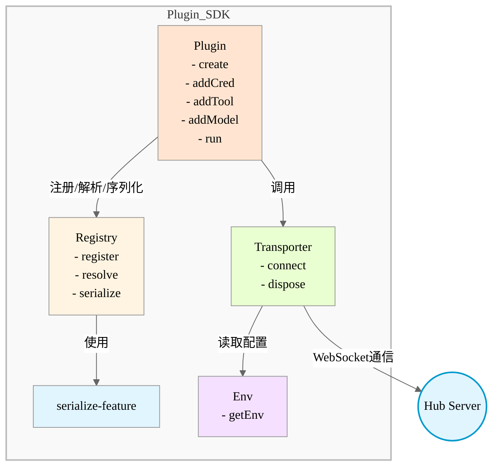
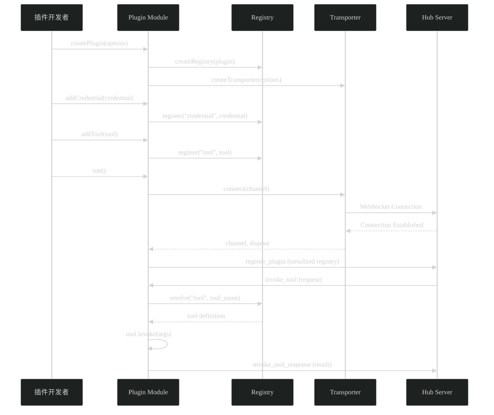
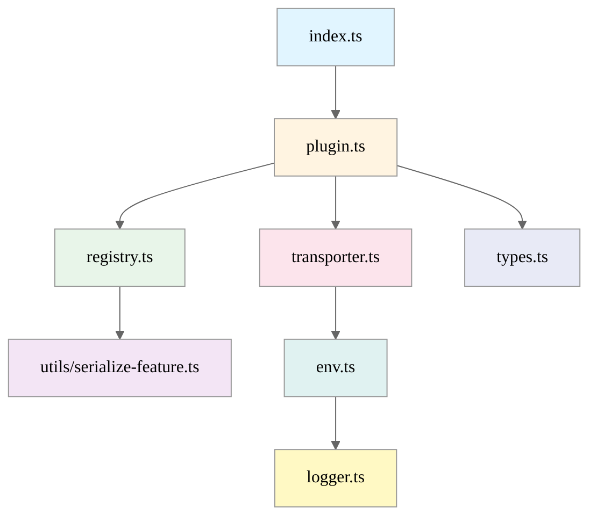

# 项目架构文档

**项目名称：** @choiceopen/automation-plugin-sdk-js  
**版本：** 0.1.0  
**最后更新：** 2025-01-27

## 概述

这是一个用于开发 Choiceform 自动化插件的 JavaScript/TypeScript SDK。该 SDK 提供了创建、注册和管理插件功能的完整框架，支持通过 WebSocket 与 Hub Server 进行通信。

## 主要功能

1. **插件定义与管理**：支持定义插件元数据、凭证、工具和模型
2. **功能注册表**：类型安全的功能注册和解析机制
3. **网络通信**：基于 Phoenix WebSocket 的实时通信
4. **工具调用**：处理来自 Hub Server 的工具调用请求
5. **环境管理**：类型安全的环境变量配置

## 技术栈

- **运行时：** Bun
- **语言：** TypeScript
- **WebSocket：** Phoenix Socket (phoenix)
- **日志：** Pino (pino, pino-pretty)
- **验证：** Zod
- **类型工具：** type-fest
- **构建工具：** tsdown
- **代码质量：** Biome

## 架构设计

### 核心模块



### 数据流



### 模块依赖关系



## 核心概念

### 1. 插件（Plugin）

插件是 SDK 的核心抽象，代表一个完整的自动化功能单元。每个插件包含：

- **元数据**：名称、显示名称、描述、图标、作者等
- **功能定义**：凭证（credential）、工具（tool）、模型（model）
- **通信配置**：传输器选项

### 2. 注册表（Registry）

注册表负责管理所有已注册的功能定义。它提供：

- **注册功能**：将功能定义存储到内存中
- **解析功能**：通过类型和名称查找功能
- **序列化**：将注册表转换为可传输的 JSON 格式

### 3. 传输器（Transporter）

传输器负责与 Hub Server 的网络通信：

- **连接管理**：建立和维护 WebSocket 连接
- **通道管理**：创建和管理 Phoenix Channel
- **事件处理**：处理连接生命周期事件
- **消息传递**：发送和接收消息

### 4. 功能类型

SDK 支持以下功能类型：

- **Credential（凭证）**：用于存储和验证认证信息
- **Tool（工具）**：可执行的功能单元，包含 `invoke` 方法
- **Model（模型）**：AI 模型定义，包含模型类型、输入/输出模态等
- **DataSource（数据源）**：数据源定义（当前未完全实现）

## 工作流程

### 插件开发流程

1. **创建插件实例**
   ```typescript
   const plugin = createPlugin({
     name: "my-plugin",
     display_name: { en_US: "My Plugin" },
     // ... 其他配置
   })
   ```

2. **注册功能**
   ```typescript
   plugin.addCredential({ /* ... */ })
   plugin.addTool({ /* ... */ })
   plugin.addModel({ /* ... */ })
   ```

3. **启动插件**
   ```typescript
   await plugin.run()
   ```

### 运行时流程

1. **初始化阶段**
   - 创建注册表和传输器
   - 验证环境变量
   - 建立 WebSocket 连接

2. **注册阶段**
   - 连接到 Hub Server 的调试通道
   - 发送插件注册信息（包含所有功能定义）

3. **运行阶段**
   - 监听工具调用请求
   - 解析请求并执行相应的工具
   - 返回执行结果或错误

4. **清理阶段**
   - 处理 SIGINT/SIGTERM 信号
   - 离开通道并断开连接
   - 退出进程

## 环境配置

### 必需的环境变量

- `HUB_SERVER_WS_URL`：Hub Server 的 WebSocket URL（格式：`ws://` 或 `wss://`）
- `DEBUG_API_KEY`：用于调试的 API 密钥

### 可选的环境变量

- `DEBUG`：是否启用调试模式（默认：非生产环境为 `true`）
- `NODE_ENV`：环境模式（`development`/`production`/`test`）

## 错误处理

### 连接错误

当无法连接到 Hub Server 时（如 API Key 过期），传输器会：
1. 检测到 101 状态码错误
2. 输出友好的错误消息
3. 提示用户运行 `atomemo plugin refresh-key`
4. 退出进程（code: 1）

### 工具调用错误

当工具调用失败时：
1. 捕获错误
2. 发送 `invoke_tool_error` 消息到 Hub Server
3. 包含错误信息和请求 ID

## 测试策略

### 单元测试

- **注册表测试**：测试功能注册、解析和序列化
- **传输器测试**：使用 mock 测试连接和事件处理
- **环境变量测试**：测试环境变量的验证和解析
- **工具函数测试**：测试序列化功能

### 测试工具

- **Bun Test**：测试运行器
- **Mock**：用于模拟 Phoenix Socket

## 待办事项

### 功能完善

- [ ] 完善 DataSource 功能的实现（当前代码中有注释掉的 data_source 相关代码）
- [ ] 添加更多的错误处理场景
- [ ] 支持插件热重载（开发环境）

### 性能优化

- [ ] 优化序列化性能（大量功能时）
- [ ] 添加连接重试机制
- [ ] 实现消息队列（处理高并发工具调用）

### 开发体验

- [ ] 添加更多的 TypeScript 类型定义
- [ ] 提供插件开发模板
- [ ] 添加开发工具和 CLI

### 文档完善

- [ ] 添加 API 文档
- [ ] 添加插件开发指南
- [ ] 添加最佳实践文档

### 测试覆盖

- [ ] 增加集成测试
- [ ] 添加端到端测试
- [ ] 提高代码覆盖率

## 相关资源

- [项目仓库](https://github.com/choice-open/automation-plugin-sdk-js)
- [Schema 包](https://www.npmjs.com/package/@choiceopen/atomemo-plugin-schema)
