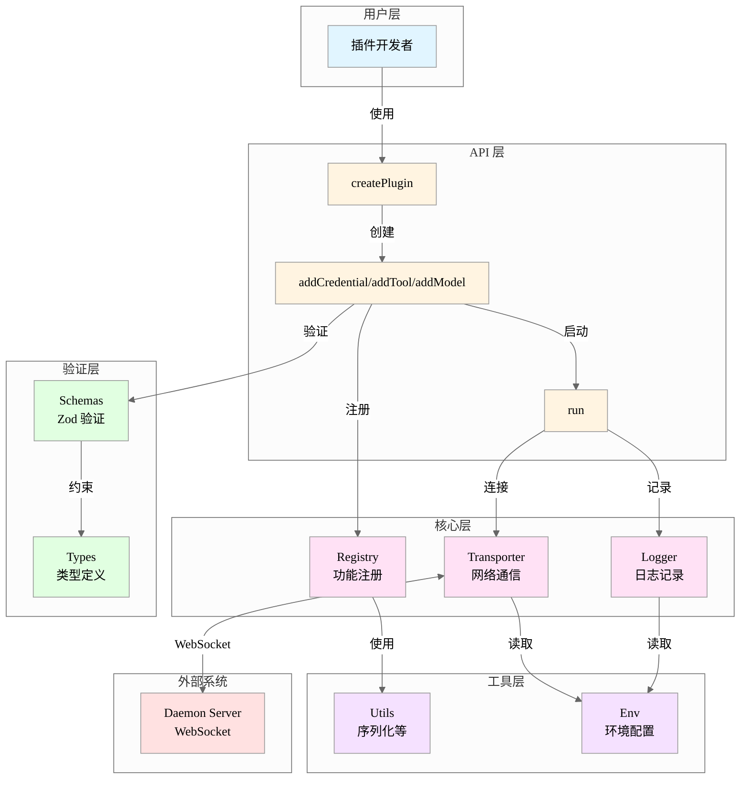
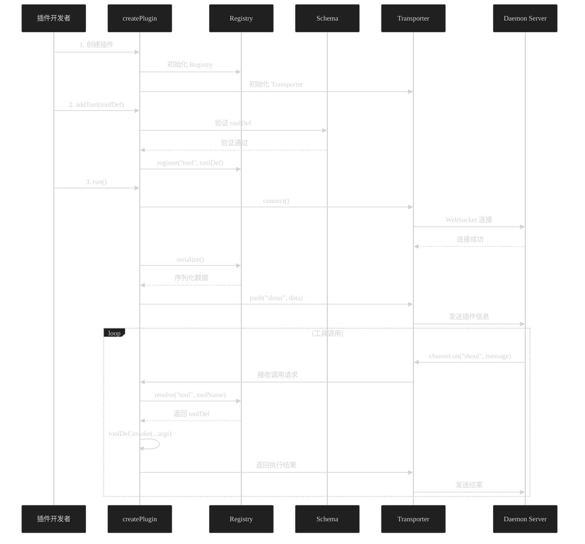
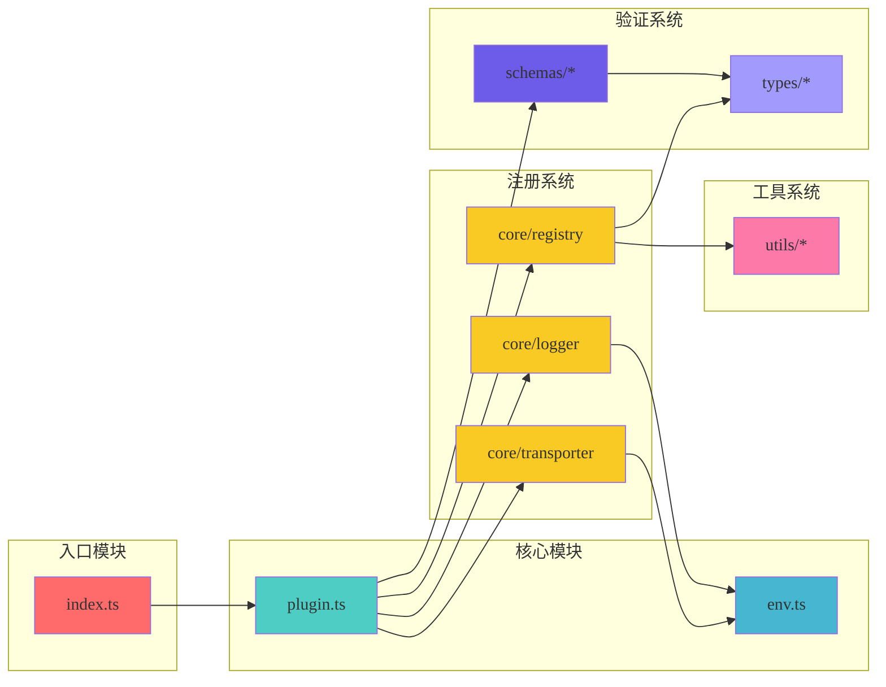

# Automation Plugin SDK - 架构文档

> **生成时间：** 2026-01-13 14:30
> **版本：** 0.0.0

## 项目概述

Choiceform Automation Plugin JavaScript/TypeScript SDK 是一个用于开发自动化插件的软件开发工具包。它提供了完整的类型系统、运行时验证和与 Daemon Server 通信的能力，使开发者能够快速构建符合规范的插件。

### 主要功能

1. **类型安全** - 完整的 TypeScript 类型定义，支持 20+ 种 UI 组件和多种数据类型
2. **运行时验证** - 基于 Zod 的 schema 验证，确保数据合法性
3. **功能注册** - 支持注册 Credential、Tool、Model、DataSource 四种功能类型
4. **网络通信** - 基于 Phoenix WebSocket 与 Daemon Server 实时通信
5. **国际化** - 内置 i18n 支持，支持多语言定义

### 技术栈

- **运行时：** Bun
- **语言：** TypeScript
- **验证：** Zod
- **网络：** Phoenix WebSocket
- **日志：** Pino
- **构建：** tsdown
- **测试：** Bun Test
- **代码质量：** Biome

## 目录结构

```
automation-plugin-sdk-js/
├── src/                          # 源代码
│   ├── core/                     # 核心功能
│   │   ├── logger.ts             # 日志管理
│   │   ├── registry.ts           # 功能注册中心
│   │   └── transporter.ts        # 网络传输层
│   ├── schemas/                  # Zod 验证模式
│   │   ├── common.ts             # 通用模式（i18n）
│   │   ├── definition.ts         # 功能定义验证
│   │   ├── property.ts           # 属性数据验证
│   │   └── property-ui.ts        # 属性 UI 验证
│   ├── types/                    # TypeScript 类型
│   │   ├── common.ts             # 通用类型（i18n）
│   │   ├── definition.ts         # 功能定义类型
│   │   ├── property.ts           # 属性数据类型
│   │   └── property-ui.ts        # 属性 UI 类型
│   ├── utils/                    # 工具函数
│   │   └── serialize-feature.ts  # 功能序列化
│   ├── env.ts                    # 环境配置
│   ├── plugin.ts                 # 插件工厂
│   ├── index.ts                  # SDK 入口
│   ├── schemas.ts                # Schema 统一导出
│   └── types.ts                  # Types 统一导出
├── tests/                        # 测试代码
│   ├── core/                     # 核心模块测试
│   └── utils/                    # 工具函数测试
├── dist/                         # 构建输出
├── package.json                  # 依赖配置
├── tsconfig.json                 # TypeScript 配置
└── tsdown.config.ts              # 构建配置
```

详细说明：
- **[src/](./src/OVERVIEW.md)** - 源代码根目录
  - **[src/core/](./src/core/OVERVIEW.md)** - 核心运行时
  - **[src/schemas/](./src/schemas/OVERVIEW.md)** - 运行时验证
  - **[src/types/](./src/types/OVERVIEW.md)** - 类型定义
  - **[src/utils/](./src/utils/OVERVIEW.md)** - 工具函数
- **[tests/](./tests/OVERVIEW.md)** - 单元测试
  - **[tests/core/](./tests/core/OVERVIEW.md)** - 核心模块测试
  - **[tests/utils/](./tests/utils/OVERVIEW.md)** - 工具函数测试

## 核心架构

### 分层架构



### 数据流



### 模块依赖关系



## 核心模块设计

### 1. Plugin Factory (`plugin.ts`)

**职责：** 创建和管理插件实例

**API：**
```typescript
createPlugin(options: PluginDefinition) => {
  addCredential(credential: CredentialDefinition): void
  addTool(tool: ToolDefinition): void
  addModel(model: ModelDefinition): void
  run(): void
}
```

**特点：**
- 自动验证功能定义（使用 Schema）
- 统一管理 Registry 和 Transporter
- 处理版本号回退（options.version || npm_package_version）
- 注册信号处理器实现优雅退出

### 2. Registry (`core/registry.ts`)

**职责：** 功能注册和管理

**数据结构：**
```typescript
interface RegistryStore {
  plugin: PluginRegistry
  credential: Map<string, CredentialDefinition>
  data_source: Map<string, DataSourceDefinition>
  model: Map<string, ModelDefinition>
  tool: Map<string, ToolDefinition>
}
```

**核心方法：**
- `register(type, feature)` - 按类型注册功能
- `resolve(type, name)` - 按类型和名称解析功能
- `serialize()` - 序列化为可传输对象

**特点：**
- 类型安全的重载方法
- 使用 Map 提高查找效率
- 自动序列化时过滤函数属性

### 3. Transporter (`core/transporter.ts`)

**职责：** WebSocket 通信管理

**架构：**
```
Socket (Phoenix)
  └── Channel ("mirror:lobby")
      ├── push("shout", data)      # 发送消息
      └── on("shout", handler)     # 接收消息
```

**核心流程：**
1. 创建 Socket 连接到 `DAEMON_SERVER_WS_URL`
2. 加入 `mirror:lobby` 频道
3. 发送序列化的插件信息
4. 监听工具调用请求并执行
5. 返回执行结果

**特点：**
- 心跳保活（默认 30 秒）
- Debug 日志（彩色输出）
- 事件回调支持
- 优雅断开连接

### 4. Type System (`types/`)

**职责：** 提供完整的类型定义

**核心类型：**

```typescript
// 功能定义
PluginDefinition
├── CredentialDefinition
├── DataSourceDefinition
├── ModelDefinition
└── ToolDefinition

// 属性系统
Property
├── PropertyString
├── PropertyNumber
├── PropertyBoolean
├── PropertyArray
│   └── items: Property
├── PropertyObject
│   └── properties: Property[]
├── PropertyCredentialId
└── PropertyEncryptedString

// UI 系统
PropertyUIProps (20+ 种组件)
├── Input, Textarea, CodeEditor
├── Select, MultiSelect, RadioGroup
├── Switch, Checkbox, Slider
├── KeyValueEditor, ArraySection
└── CollapsiblePanel, CredentialSelect
```

**设计特点：**
- 递归类型支持嵌套属性
- 判别联合实现多态数组
- UI 组件与数据类型解耦
- 完整的泛型支持

### 5. Validation System (`schemas/`)

**职责：** 运行时数据验证

**验证策略：**
1. **基础验证** - 类型、格式、范围
2. **复杂约束** - 跨字段依赖、唯一性
3. **递归验证** - 嵌套结构
4. **类型一致性** - 与 Type 保持同步

**关键验证：**
- `name` 命名规则（4-64 字符，字母开头，无特殊字符）
- `I18nText` 必须包含 `en_US`
- `DiscriminatedUnion` discriminator 唯一性
- `Property.name` 不能包含 `.`, `[`, `]`
- 属性名称去重

## 通信协议

### WebSocket 连接

```
ws(s)://daemon-server/socket
  └── channel: mirror:lobby
      ├── join() -> { status: "ok" | "error" }
      ├── push("shout", payload)
      └── on("shout", callback)
```

### 消息格式

**插件注册（Plugin -> Server）：**
```json
{
  "plugin": {
    "name": "my-plugin",
    "display_name": { "en_US": "My Plugin" },
    "description": { "en_US": "..." },
    "icon": "🔌",
    "author": "...",
    "email": "...",
    "version": "1.0.0",
    "locales": ["en_US"],
    "credentials": [...],
    "data_sources": [...],
    "models": [...],
    "tools": [...]
  }
}
```

**工具调用（Server -> Plugin）：**
```json
{
  "providerName": "my-plugin",
  "featureName": "my-tool",
  "args": [...]
}
```

## 设计模式

### 1. Factory Pattern
`createPlugin`, `createRegistry`, `createTransporter` 使用工厂模式创建实例

### 2. Registry Pattern
`Registry` 作为中央注册中心管理所有功能

### 3. Strategy Pattern
不同类型的 `Property` 和 `PropertyUI` 使用策略模式

### 4. Observer Pattern
WebSocket 事件监听使用观察者模式

### 5. Singleton Pattern
`logger` 和 `env` 使用单例模式

## 扩展点

### 1. 新增功能类型
在 `FeatureType` 中添加新类型，并在 `Registry` 中添加对应的 Map

### 2. 新增 UI 组件
在 `property-ui.ts` 中定义类型，在对应 Schema 中添加验证

### 3. 新增属性类型
在 `property.ts` 中定义类型，在 Schema 中添加验证规则

### 4. 自定义验证规则
在 Schema 中使用 `refine` 或 `superRefine` 添加自定义验证

## 性能考虑

1. **Map 存储** - Registry 使用 Map 提高查找效率（O(1)）
2. **懒加载** - env 配置懒加载并缓存
3. **序列化优化** - 只序列化必要字段，过滤函数
4. **类型推导** - 编译时类型检查，减少运行时开销

## 安全考虑

1. **环境变量验证** - 严格验证 WebSocket URL 格式
2. **加密字段** - 支持 `encrypted_string` 类型和 `encrypted-input` 组件
3. **敏感信息** - UI 组件支持 `sensitive` 标记
4. **输入验证** - 所有用户输入通过 Schema 验证
5. **WebSocket 安全** - 支持 WSS 协议

## 测试策略

1. **单元测试** - 测试核心模块（Registry, Transporter, Utils）
2. **类型测试** - 使用 `IsEqual` 确保 Schema 与 Type 一致
3. **集成测试** - 测试完整的插件创建和运行流程
4. **验证测试** - 测试 Schema 的各种验证规则

**当前状态：**
- ✅ Registry 单元测试（需要更新到新 API）
- ⚠️ 部分测试文件对应源文件不存在
- ❌ 缺少集成测试和验证测试

## 未来优化方向

1. **测试覆盖** - 补充完整的单元测试和集成测试
2. **文档生成** - 自动生成 API 文档
3. **错误处理** - 统一的错误类型和错误码
4. **性能监控** - 添加性能指标收集
5. **调试工具** - 提供更好的开发者工具
6. **类型增强** - 更精确的类型推导和约束
7. **插件热重载** - 支持开发时热重载

## 待办事项

基于代码分析发现的问题和改进建议：

### 🔴 高优先级

- [x] **删除失效测试文件** ✅ 已完成

- [x] **更新 Registry 测试** ✅ 已完成
  - 已根据当前 `createRegistry(plugin)` API 重写测试
  - 测试覆盖 `register()`, `resolve()`, `serialize()` 方法

- [x] **清理旧文档文件** ✅ 已完成

### 🟡 中优先级

- [x] **完善 package.json 元信息** ✅ 已完成

- [ ] **添加 DataSource 支持**
  - `plugin.ts` 缺少 `addDataSource()` 方法（Registry 已支持 `data_source` 类型）

- [ ] **增强错误处理**
  - `transporter.ts` 中的错误处理可以更完善
  - 添加重连机制

### 🟢 低优先级

- [ ] **添加集成测试**
  - 测试完整的插件创建、注册、运行流程

- [ ] **Schema 验证测试**
  - 测试各种 Schema 的边界条件

- [ ] **文档增强**
  - 添加使用示例
  - 添加 API 文档生成
- [x] **文档清理** ✅ 已完成

## 参考资源

- **Phoenix Framework:** https://www.phoenixframework.org/
- **Zod:** https://zod.dev/
- **Pino:** https://getpino.io/
- **Bun:** https://bun.sh/
- **TypeScript:** https://www.typescriptlang.org/
